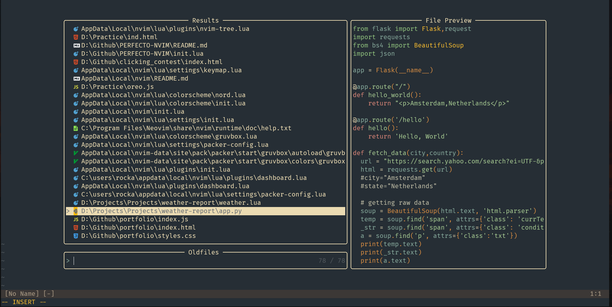
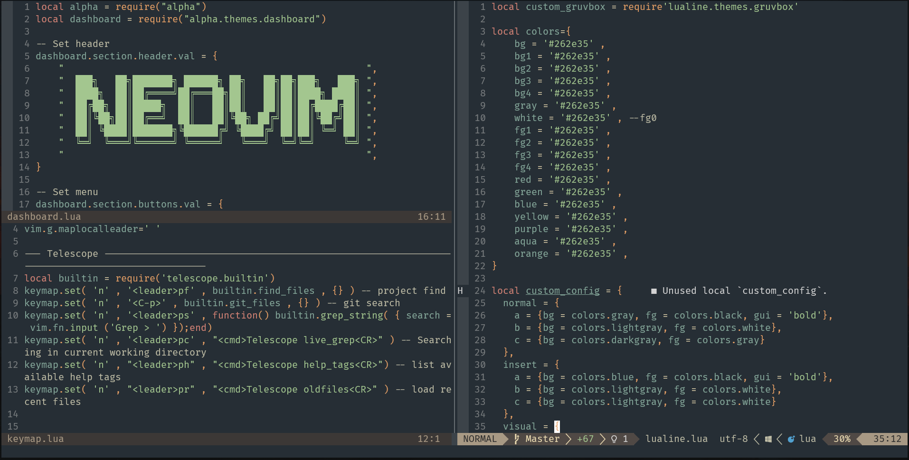
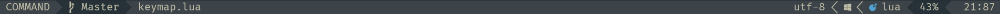

# This is config II
* Made from square one to understand the true essence
* Modularized so that one doesnt affect other (except packer-config ofc)

## Addressed Issues
* **coc.nvim** : Problems with loading certain documents

## Custom Color Schemes
will be uploading soon :)

## Plugins
* LuaSnip
* alpha-nvim
* cmp-nvim-lsp
* coc.nvim
* fd
* feline.nvim
* fidget.nvim
* glow.nvim
* gruvbox
* lualine.nvim
* mason-lspconfig.nvim
* mason.nvim
* neodev.nvim
* nvim-cmp
* nvim-lspconfig
* nvim-tree.lua
* nvim-treesitter
* nvim-web-devicons
* onedark.nvim
* packer.nvim
* plenary.nvim
* presence.nvim
* ripgrep
* telescope.nvim
* telescope-undo.nvim

## Screenshots

### With custom color pallette

### Lualine

